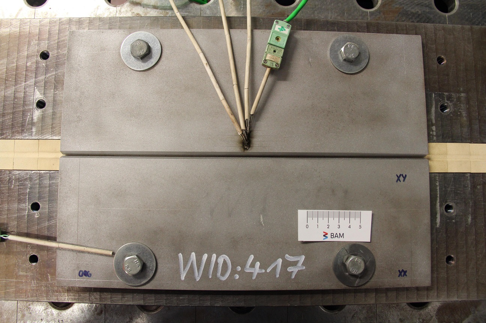
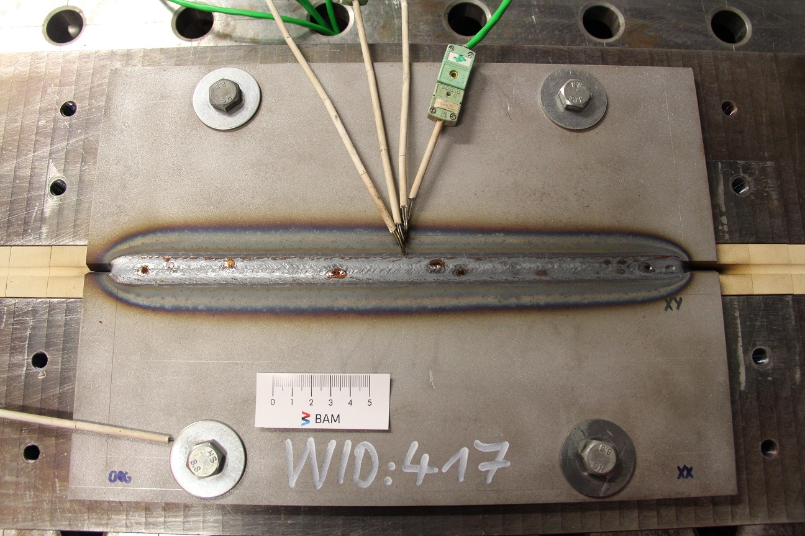
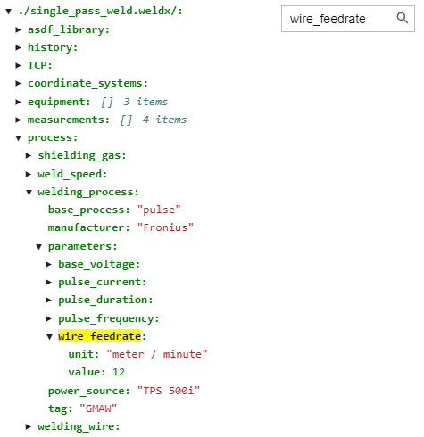
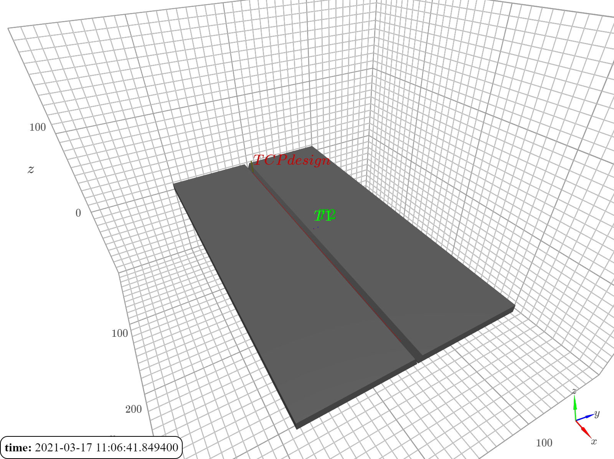
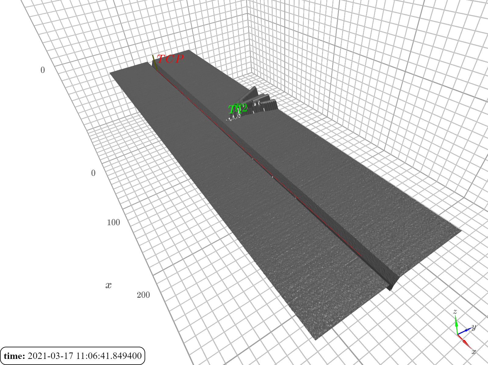
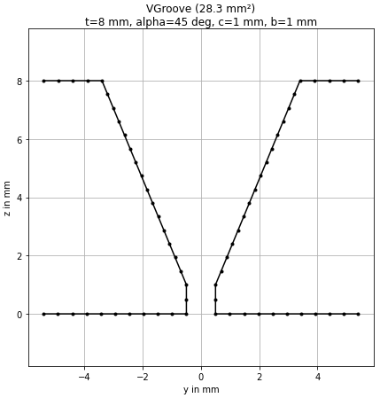
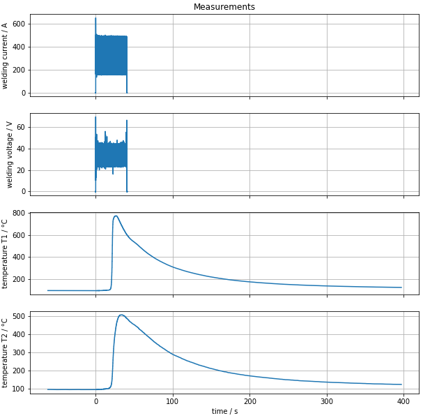
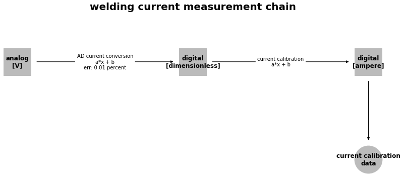

# WelDX @ 2021 IIW Annual Assembly Comm. XII meeting

Repository providing code and datasets accompanying **IIW Doc. XII-2476-2021: WelDX - progress report on the welding
data exchange format**

Talk held online at the 2021 IIW Annual Assembly Comm. XII meeting on 15.07.2021.

### launch on binder

You can launch the notebook for this presentation following this link:\
https://mybinder.org/v2/gh/BAMWelDX/IIW2021_AA_CXII/main?urlpath=lab/tree/iiw2021_CXII_fabry_cagtay_01.ipynb

### links

- WelDX documentation: https://weldx.readthedocs.io/en/latest/
- WelDX GitHub: https://github.com/BAMWelDX/weldx
- WelDX project page: https://www.bam.de/Content/EN/Projects/WelDX/weldx.html

## contents

The example describes a single pass V-Groove weld of 8 mm steel plates.\
All data is stored in the `single_pass_weld.weldx` file.

<video width="600" src="./data/WID417.avi" controls>
  Your browser does not support the video tag.
</video>

Here are the before and after images of the experimental setup:

 

The interactive notebook demonstrates the contents of the `weldx` file containing the complete dataset and core features
of the `weldx` package.

### file content browsing

Interactively browse and search contents of weldx files.

### 3D visualization

Create an interactive 3D visualization of the experiment design.

And compare it with the real data collected during the experiment.

### welding groove shapes

Easily create and directly work with welding groove shapes.

### measurements

Store all related measurement data in a single file.

The measurement chain can be described in detail.

